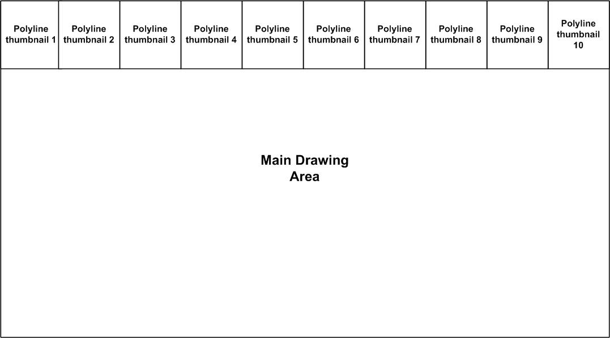
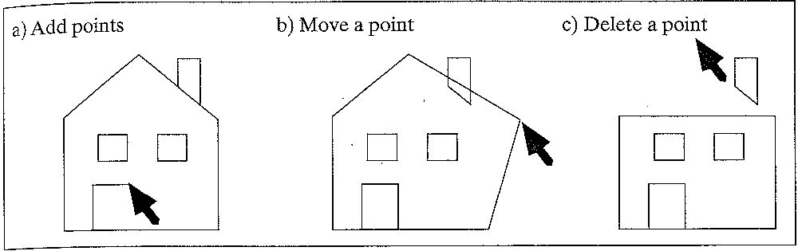

###Original Source: 
http://web.cs.wpi.edu/~emmanuel/courses/cs543/f13/homework/HW1/HW1.html     
<H3> Homework 1: <i> PoliBook</i>, an interactive polyline viewer and editor</H3>

<H3> Homework 1 Overview </H3>

The aim of this project is to get you comfortable with working in 2D using OpenGL 4.0. 
You will be setting viewports, world windows, drawing and tiling polylines, rendering fractals and exploring
keyboard and mouse interaction routines. You will create a program <i><b> Polibook</b></i> which 
views polyline files in interesting ways and also allows you to interactively draw 
your own polylines onto the screen.

Here goes:

  <B> Step 1: Read more polyline files in GRS format:</B>   
Starter code is provided to ensure that your code runs on the zoolab machines right away.
You can get the HW1 starter code <a href="../src/cs543_hw1_starter_code.zip"> [ HERE ] </a>
Use this starter code to develop your programs.
The following polyline files are in the GRS format:  

<A href="GLSLExperiment/dino.dat">dino.dat</A> 
<A href="GLSLExperiment/birdhead.dat">birdhead.dat</A> 
<A href="GLSLExperiment/dragon.dat">dragon.dat</A> 
<A href="GLSLExperiment/house.dat">house.dat</A> 
<A href="GLSLExperiment/knight.dat">knight.dat</A> 
<A href="GLSLExperiment/rex.dat">rex.dat</A> 
<A href="GLSLExperiment/scene.dat">scene.dat</A> 
<A href="GLSLExperiment/usa.dat">usa.dat</A> 
<A href="GLSLExperiment/vinci.dat">vinci.dat</A>  

The structure of GRS files is:

<UL>
<LI> a number of comment lines, followed by a line starting with at least one asterisk: '*'. 
<LI> The "extent" of the figure: (left, top, right, bottom). 
<LI> The number of polylines in the figure. 
<LI> The list of polylines: each starts with the number of points in the polyline, followed by the (x, y) pairs for each point. 
</UL>

  First,  modify the starter code to read in one of the GRS files. The plan is that
when you re-compile it, the polyline file is drawn on the screen. 
There are a few things you should note for your implementation. 

<OL>
<LI> Be careful with how you pass parameters to the glViewport( ), Ortho2D( ) commands. Make sure you understand how they work.
<LI> The "extent" line of the GRS file will be used to set the world window i.e. passed to Ortho2D( )
<LI> If you look at the vertex coordinates of some of the
GRS files, they are specified in floating point numbers, so you'll have to use float or double formats as appropriate. 
For instance, the x and y coordinates of the vertices of dino.dat are integers, while the vertices in the other GRS
files are floating point numbers. 
<LI> Note that a lot of the GRS files start with comments. You
can either manually cut those out or read them in and dump them in your program. 
<LI> The format for dino.dat is a little 
different in that it doesn't have the window dimensions (or comments) right at the top. Therefore, off the bat, a program
which reads other GRS files without problems will have new problems with dino.dat file. You can either throw in 
a dummy extents window  at the top of dino.dat or come up with a solution that works. <b>Hint: </b>a world window of (0,640,0,480) should work!!

</OL>

 

 <B>Summary of Your program behavior</B> 

The figure above shows the layout of a polyline viewer you should
produce. At the top of your viewport, 10 thumbnails (9 thumbnails of polylines above + 2 occurrences of vinci.dat)
of the polyline files should be lined up. These 10 thumbnails should ALWAYS be visible at the
top edge of the viewport whenever your program is running.
The larger drawing area below the thumbnails is the main drawing area
in which all drawing will be done. On start up, choose one of
the polyline files to draw in the main drawing area as a default.
The thumbnails AND main drawing automatically
resize if the viewport is expanded or resized.    

Clicking on any thumbnails lined up at the top should make the 
corresponding polyline file the current drawing and draw a larger version of the polyline
file to fill the main drawing area while maintaining aspect ratio.
This is also known as the 'p state'.  More details
on the program behavior is given below.

Your program should also have the following behavior and user
(keyboard and mouse) interaction capabilities when you run it:
  

<b>Event</b>: A key is pressed:

<UL>

<LI><b>'p' key: (state p) Response:</b> the program draws all 
polyline files provided at the top of the viewport 
in 10 equal-sized thumbnails (9 thumbnails of polylines above + 2 occurrences of vinci.dat)
and randomly picks one to draw in large dimensions in the
"main drawing window" . In the state p, if a user clicks on any of the thumbnails at the top,
the corresponding polyline file in that thumbnail becomes the current drawing.
The "main drawing space" is erased and the polyline in that thumbnail is redrawn to fill the entire
"main drawing space".  

<LI><b>'t' key: (state t) Response:</b> An  6x6 tiling of all polyline files
is drawn in the "main drawing space" (polyline thumbnails still at top edge). Repeatedly
hitting the 't' key should create a different 6x6 tiling where the polyline picked for
any tile is "random".(polyline thumbnails still at the top edge and aspect ratios 
are maintained within each tile)  

<LI><b>'e' key (state e) Response:</b> PoliBook clears the screen and goes
into drawing mode (polyline thumbnails still at the top edge). On the
first click in the drawing area, a dot is drawn at wherever the user clicked.
On subsequent clicks, a line is drawn from the last accepted mouse click position
to the current mouse click position. Your program should be set up to accept up
to 100 possible mouse clicks in one polyline. You can accept and store user-provided
points in an array. If the 'b" key is held down while clicking, the current click
point is <b>NOT</b> joined to the previous click point and instead a fresh polyline is
started and drawn in addition to whatever previous polyline had been drawn. For
instance, holding the "b" key down may be useful for beginning to draw the
window of a house after drawing other parts. Part a) of the figure below shows 
how the drawing or addition of points works. The
example shows a house in the process of being drawn; the user has just clicked at
the position shown, and a line has been drawn from the previous point to the
one designated by the mouse.  

<LI><b>'m' key (state m) Response:</b> Move a previously drawn point on the
current polyline. Part b) of the figure below shows this move in action. 
The user positions the cursor near the vertex of some polyline, presses down
the mouse button, and "drags" the chosen point to some other location before
releasing the button. Upon release of the button, the previous lines connected to this
point are erased, and new lines are drawn to it.  

<LI><b>'d' key (state d) Response:</b> Delete a point from a polyline. Part c) of 
the figure below shows how a point is deleted from a polyline. The user clicks near
the vertex of some polyline, and the two line segments connected to that vertex
are erased. Then the two other endpoints of the segments just erased are connected with
a line segment.  

<LI><b>'g' key (state g) Response:</b> Clear the screen and draw the gingerbread man described
in class.  

<LI>esc: <b>Response</b>: The program terminates.

</UL>

  

  

<b>Note:</b> States (p and t) are polyline viewing states in which you 
can draw polyline files stored in a .dat file. States (e, m and d)
are polyline drawing states. State e is the initial drawing state and
states (m and d) are only accessible from state e. In the drawing states, you
should be able to accept and draw new polylines onto the screen, but your program does NOT have
to be able to edit the provided ones (e.g. dino.dat, usa.dat, etc).
You also don't have to be able to save or write out the polyline file drawn
on the screen to a file. You may choose to do that but no extra credit will be given.
<b>Make sure that reshape works for all states (p, t, e, m, d and g)</b>.
i.e. if the user grabs the lower right corner of the window and increases or reduces the
screen window size, whatever was drawn in it  before (and thumbnails) is redrawn to the largest
possible size, without distortion (i.e. always maintain correct aspect ratio for each polyline file
when drawn either as thumbnails or in the main drawing window).  

<b>Important Notes: </b> No deprecated OpenGL commands, fixed function commands (glBegin, glVertex, etc) or 
immediate mode drawing commands should be used in your program. All drawing should be done using shaders, 
retained mode, Vertex Buffer Objects, and glDrawArrays similar to the code in your textbook (and in the starter code)

 <h2> Submitting Your Work</h2> 

<b> Your final submission must be configured to work and fully tested in
the zoolab.</b>  Points will be docked for submissions that do not compile or require
ANY modifications to compile. The starter Visual Studio package provided is configured 
to work in the zoolabs. It is strongly advised that you use the starter package to avoid
porting problems at the end. Porting OpenGL code is non-trivial due to 
platform differences.

Make sure to double-check that everything works before submitting.
Submit all your executable and source files. 
Put all your work files (Visual Studio solution, OpenGL program, shaders,
executable and input files into a folder and zip it. Essentially,
after your project is complete, just zip the project directory created
by Visual Studio. Submit your work through turnin. Do NOT email me or
the grader your homework!!   

Create documentation for your program and submit it along with the project inside the zip file. 
Your documentation can be either a pure ASCII text or Microsoft Word file.
The documentation does not have to be long. Briefly describe the structure of your program, 
what each file turned in contains. Explain briefly what each module does and 
tie in your filenames. Most importantly, give clear instructions on how
to compile and run your program. <b> MAKE SURE IT RUNS </b> before submission. 
Name your zip file according to the convention <i>FirstName_lastName_hw1.zip</i>    

<b> General Hints</b>  

Here are a more few hints you might find useful:

<ul>
<LI> You need to modify your keyboard( ) function in order to react to keyboard input 
from the user and your mouse( ) function to react to mouse input.

<LI> The following sections of Hill may be useful in doing your work:
<ul>
<LI> Section 2.11 of your text explains simple mouse and keyboard
interaction using openGL.
</ul>
</ul>

Please read:

opengl-quick-reference-card.pdf
glsl_quickref.pdf
The OpenGL Shading Language.pdf

before starting.

OGL manpages:
http://www.opengl.org/sdk/docs/manglsl/
