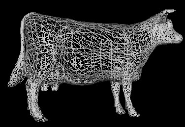

###Original Link: http://web.cs.wpi.edu/~emmanuel/courses/cs543/f13/homework/HW2/HW2.html 

<h2> Homework 2: Due Tuesday October 8, 2013, emailed by class time (10/100 points) </h2>

<h3> Homework 2 Overview </h3>

In this project, you will load a mesh stored in the  .ply file format, 
render it as a 3D wireframe model using Vertex Buffer Objects
and also add keyboard control that lets us interact with 
the .ply files. A few optional preparation steps
are suggested. You will not turn in the code which you generate in your
preparatory steps.

 <h3> Preparation</h3> 

<ul>
<li><b>Read section 3.6 of your text:</b> Code to render a cube is described in that section.  

</li><li> Some starter code, a working implementation of this cube program, which runs in the zoolab has been created. You can get this starter code here
<a href="http://web.cs.wpi.edu/~emmanuel/courses/cs543/f13/homework/HW2/graphics_starting_code_2.zip"> [ Starter Code ] </a>.  
Compile the cube program and make sure it runs okay in the zoolab. As mentioned previously, <b>I will help mostly
with questions about getting the starter code working in the zoolab</b>. However, one problem that some students may have problems on their home machines is that
OpenGL 3.2 has problems with glGenVertexArrays under Linux. You can find some fixes to this bug on the class <a href="http://web.cs.wpi.edu/~emmanuel/courses/cs4731/B11/faq.html#txtbook_1"> [ FAQ Page ] </a>  
</li><li> Modify your program to <b> read in .ply files and store them in a vertex list data structure</b>. A vertex list is described in some detail in
Section 3.6.3 of the text. You can get 43 PLY files to 
     work with <a href="http://web.cs.wpi.edu/~emmanuel/courses/cs543/f13/homework/HW2/ply_files.zip"> [ Here ] </a>. Further explanations about the format for PLY files are given below.  

</li><li> Modify your program to <b> render wireframe drawings of your .ply files</b> from your vertex list using Vertex Buffer Objects (VBOs) and glDrawArrays as with the cube. Here's an
     example wireframe drawing of the cow.ply file:   

  

</li><li> <b>Set up a Current Transform Matrix (CTM) </b> as described in section 3.11 of the text. The starter code includes [ Angel.h ] which already includes [ mat.h ] and [ vec.h]
      You may use the matrix and vector manipulation methods in these header files for your work.  

</li><li> <b> Calculate the normal of each mesh face </b> using the Newell method and then generate <b> face normals</b>   

</li><li> <b> Pulsing Meshes </b> 
One simple yet visually interesting way to animate a mesh is to make it "pulse" by translating 
each <b>face</b> some fixed amount in its normal direction. By linearly interpolating the position of each vertex belonging to a given face 
between its original position and v+cn (where c is a constant) and then interpolating back in the 
opposite direction, we can make the mesh bulge outward and then recede in a smooth fashion. 
This operation should make the meshes look like they are "breathing" back and forth.
Note that when the mesh breathes in, the faces of the mesh are in their original positions
and when the mesh breathes out, the faces move outwards and temporarily separate from neighboring faces.
Make sure the faces move out enough for the bulging effect to be noticeable and make the face movements
nice and smooth (Not too fast).  

<!--<LI> Positional shading </b> Positional Shading
One way to shade a mesh that does not involve any lighting calculations is to assume that the mesh 
is scaled and centered inside the unit RGB color-space cube. We may then trivially assign a color 
value to every point on the mesh by associating its three-dimensional position with the corresponding 
RGB color. You should implement this "positional" shading on a per-pixel basis in a fragment program. -->

</li><li> <b> Implement keyboard controls </b> that enable you to perform the keyboard controls described below in the section "Behavior of your submitted program".  
</li></ul>

 

<h3> Behavior of your submitted program</h3> 

<ul>
<li><b> User hits 'W' (Draw your wireframe) </b> at a suitable initial position from the viewer.   

</li><li><b> User hits 'N' (Draw next wireframe) </b> Organize the PLY files in a list going from 1-43. Hitting
N should load and draw the next wireframe model to the current one in your list of PLY files. You can
hardcode filenames if you want. The PLY files may not all be of the same size. So to properly set up
the viewing position using LookAt, you may have to calculate the bounding box of the mesh and then
set your view distance to a suitable multiple of the bounding box  
 
</li><li><b> User hits 'P' (Draw previous wireframe) </b> Organize the PLY files in a list going from 1-43. Hitting
P should load and draw the previous wireframe model to the current one in your list of PLY files.   

</li><li><b> User hits 'X' (Translate your wireframe in the +ve X direction) </b> Continously move your wireframe
some small units along the +ve X axis and redraw it. Use the idle function to animate this. The 
ply file should continue to slide along the +ve X axis till the user hits 'X' again. Essentially,
the 'X' key acts as a toggle key. If the ply file is stationary and the user hits the 'X' key, the
ply file should continue to slide along the +ve X axis until the user hits 'X' again. Camera position remains fixed for
this translation and all other translations below. The exact amount to move the ply file before
redrawing will affect how much and how much your translation is apparent
depends on how far you positioned your wireframe from the viewer. So, it's left to you
as a design choice to pick an appropriate distance to translate the wireframe along the +ve X axis 
each time the user hits 'X'.   

</li><li><b> User hits 'x' (Translate your wireframe in the -ve X direction) </b> Use the idle function 
to continuously move your wireframe
some units along the -ve X axis. The number of units to translate your wireframe
each time the user hits 'x' is left to you as a design choice.   

</li><li><b> User hits 'Y' (Translate your wireframe in the +ve Y direction) </b> Use the idle function 
to continuously move your wireframe
some units along the +ve Y axis. The number of units to translate your wireframe
each time the user hits 'Y' is left to you as a design choice.   

</li><li><b> User hits 'y' (Translate your wireframe in the -ve y direction) </b> Use the idle function 
to continuously move your wireframe
some units along the -ve Y axis. The number of units to translate your wireframe
each time the user hits 'y' is left to you as a design choice.   

</li><li><b> User hits 'Z' (Translate your wireframe in the +ve Z direction) </b> 
Use the idle function to continuously move your wireframe
some units along the +ve Z axis. The number of units to translate your wireframe
each time the user hits 'Z' is left to you as a design choice.   

</li><li><b> User hits 'z' (Translate your wireframe in the -ve Z direction) </b> 
Use the idle function to continuously move your wireframe
some units along the -ve Z axis. The number of units to translate your wireframe
each time the user hits 'z' is left to you as a design choice.   

</li><li><b> User hits 'R' (Rotate your wireframe about it's <b>CURRENT</b> position) </b> 
Just like in a showroom where the wireframe is on a swivel, rotate your wireframe
smoothly 360 degrees at a moderate speed about its CURRENT position (not about the center of the scene) 
This rotation is NOT the same as moving the wireframe in a wide arc. The rotation should be 
about the Y axis and the wireframe should not translate while rotating.
After each 360 degree rotation of the "current" PLY file, load and display the "next" (of the 43 PLY) files. 
In this way, after 43 cycles, all polyline files should have been drawn one by one.
On the 44th cycle, go back and display the first PLY file that was drawn.
Finally, alternate between rotating PLY files clockwise and counter-clockwise.
For instance, PLY file 1 should rotate 360 degrees clockwise before loading PLY file 2 which
rotates counterclockwise before loading PLY file 3 which rotates clockwise, and so on.

Hint: Use double buffering (glutSwapBuffers( )) to make the rotation smooth. 
You can continously update the new wireframe positions and redisplay the meshes in the glutIdleFunc function.   

</li><li><b> User hits Key 'B': </b> Toggle pulsing meshes ON/OFF. When ON, the mesh faces pulse back and forth 
continuously as described above. When OFF the meshes do not pulse. Hint: Use double buffering (glutSwapBuffers( )) 
to make the breathing smooth. You can continously update the new vertex positions and redisplay the meshes in the
 glutIdleFunc function.  

</li><li><b> User hits Key 'm': </b> Toggle a drawing of each face normal (ON/OFF). When ON, the mesh normals of all mesh
faces are drawn. When off, the face normals are not drawn. Each face normal is drawn as a short line starting from the middle
of each face and extending outwards. When you draw all normals, it will look like the mesh has pins sticking out of each face  

</li><li><b> User hits Key 'e': </b> Toggle a drawing of the extents (bounding box) of each mesh (ON/OFF). When ON, a
bounding box is drawn around the mesh. When off, the bounding box is not drawn. The bounding box is the smallest
cuboid that contains each mesh. Since the meshes are all different sizes, they will all have different bounding boxes  

</li></ul>

<h3> PLY File format</h3> 

This file format, also known as the Stanford Triangle Format, looks like:  

<table class="MsoTableGrid" border="1" cellspacing="0" cellpadding="0" style="border-collapse:collapse;border:none;mso-border-alt:solid windowtext .5pt;
 mso-yfti-tbllook:480;mso-padding-alt:0in 5.4pt 0in 5.4pt;mso-border-insideh:
 .5pt solid windowtext;mso-border-insidev:.5pt solid windowtext">
 <tbody><tr style="mso-yfti-irow:0;mso-yfti-firstrow:yes">
  <td width="295" valign="top" style="width:221.4pt;border:solid windowtext 1.0pt;
  mso-border-alt:solid windowtext .5pt;padding:0in 5.4pt 0in 5.4pt">
  
<b style="mso-bidi-font-weight:normal">File Text<o:p></o:p></b>

  </td>
  <td width="295" valign="top" style="width:221.4pt;border:solid windowtext 1.0pt;
  border-left:none;mso-border-left-alt:solid windowtext .5pt;mso-border-alt:
  solid windowtext .5pt;padding:0in 5.4pt 0in 5.4pt">
  
<b style="mso-bidi-font-weight:normal">What you should do<o:p></o:p></b>

  </td>
 </tr>
 <tr style="mso-yfti-irow:1">
  <td width="295" valign="top" style="width:221.4pt;border:solid windowtext 1.0pt;
  border-top:none;mso-border-top-alt:solid windowtext .5pt;mso-border-alt:solid windowtext .5pt;
  padding:0in 5.4pt 0in 5.4pt">
  
Ply<o:p></o:p>

  </td>
  <td width="295" valign="top" style="width:221.4pt;border-top:none;border-left:
  none;border-bottom:solid windowtext 1.0pt;border-right:solid windowtext 1.0pt;
  mso-border-top-alt:solid windowtext .5pt;mso-border-left-alt:solid windowtext .5pt;
  mso-border-alt:solid windowtext .5pt;padding:0in 5.4pt 0in 5.4pt">
  
If not
  present, exit<o:p></o:p>

  </td>
 </tr>
 <tr style="mso-yfti-irow:2">
  <td width="295" valign="top" style="width:221.4pt;border:solid windowtext 1.0pt;
  border-top:none;mso-border-top-alt:solid windowtext .5pt;mso-border-alt:solid windowtext .5pt;
  padding:0in 5.4pt 0in 5.4pt">
  
Format
  ascii 1.0<o:p></o:p>

  </td>
  <td width="295" valign="top" style="width:221.4pt;border-top:none;border-left:
  none;border-bottom:solid windowtext 1.0pt;border-right:solid windowtext 1.0pt;
  mso-border-top-alt:solid windowtext .5pt;mso-border-left-alt:solid windowtext .5pt;
  mso-border-alt:solid windowtext .5pt;padding:0in 5.4pt 0in 5.4pt">
  
Skip line<o:p></o:p>

  </td>
 </tr>
 <tr style="mso-yfti-irow:3">
  <td width="295" valign="top" style="width:221.4pt;border:solid windowtext 1.0pt;
  border-top:none;mso-border-top-alt:solid windowtext .5pt;mso-border-alt:solid windowtext .5pt;
  padding:0in 5.4pt 0in 5.4pt">
  
element
  vertex 758<o:p></o:p>

  </td>
  <td width="295" valign="top" style="width:221.4pt;border-top:none;border-left:
  none;border-bottom:solid windowtext 1.0pt;border-right:solid windowtext 1.0pt;
  mso-border-top-alt:solid windowtext .5pt;mso-border-left-alt:solid windowtext .5pt;
  mso-border-alt:solid windowtext .5pt;padding:0in 5.4pt 0in 5.4pt">
  
Read # of
  vertices (758)<o:p></o:p>

  </td>
 </tr>
 <tr style="mso-yfti-irow:4">
  <td width="295" valign="top" style="width:221.4pt;border:solid windowtext 1.0pt;
  border-top:none;mso-border-top-alt:solid windowtext .5pt;mso-border-alt:solid windowtext .5pt;
  padding:0in 5.4pt 0in 5.4pt">
  
property
  float32 x<o:p></o:p>

  
property
  float32 y<o:p></o:p>

  
property float32
  z<o:p></o:p>

  </td>
  <td width="295" valign="top" style="width:221.4pt;border-top:none;border-left:
  none;border-bottom:solid windowtext 1.0pt;border-right:solid windowtext 1.0pt;
  mso-border-top-alt:solid windowtext .5pt;mso-border-left-alt:solid windowtext .5pt;
  mso-border-alt:solid windowtext .5pt;padding:0in 5.4pt 0in 5.4pt">
  
Skip
  these lines<o:p></o:p>

  </td>
 </tr>
 <tr style="mso-yfti-irow:5">
  <td width="295" valign="top" style="width:221.4pt;border:solid windowtext 1.0pt;
  border-top:none;mso-border-top-alt:solid windowtext .5pt;mso-border-alt:solid windowtext .5pt;
  padding:0in 5.4pt 0in 5.4pt">
  
element
  face 1140<o:p></o:p>

  </td>
  <td width="295" valign="top" style="width:221.4pt;border-top:none;border-left:
  none;border-bottom:solid windowtext 1.0pt;border-right:solid windowtext 1.0pt;
  mso-border-top-alt:solid windowtext .5pt;mso-border-left-alt:solid windowtext .5pt;
  mso-border-alt:solid windowtext .5pt;padding:0in 5.4pt 0in 5.4pt">
  
Read # of
  polygons (1140)<o:p></o:p>

  </td>
 </tr>
 <tr style="mso-yfti-irow:6">
  <td width="295" valign="top" style="width:221.4pt;border:solid windowtext 1.0pt;
  border-top:none;mso-border-top-alt:solid windowtext .5pt;mso-border-alt:solid windowtext .5pt;
  padding:0in 5.4pt 0in 5.4pt">
  
property
  list uint8 int32 vertex_indices<o:p></o:p>

  </td>
  <td width="295" valign="top" style="width:221.4pt;border-top:none;border-left:
  none;border-bottom:solid windowtext 1.0pt;border-right:solid windowtext 1.0pt;
  mso-border-top-alt:solid windowtext .5pt;mso-border-left-alt:solid windowtext .5pt;
  mso-border-alt:solid windowtext .5pt;padding:0in 5.4pt 0in 5.4pt">
  
Skip line<o:p></o:p>

  </td>
 </tr>
 <tr style="mso-yfti-irow:7">
  <td width="295" valign="top" style="width:221.4pt;border:solid windowtext 1.0pt;
  border-top:none;mso-border-top-alt:solid windowtext .5pt;mso-border-alt:solid windowtext .5pt;
  padding:0in 5.4pt 0in 5.4pt">
  
end_header<o:p></o:p>

  </td>
  <td width="295" valign="top" style="width:221.4pt;border-top:none;border-left:
  none;border-bottom:solid windowtext 1.0pt;border-right:solid windowtext 1.0pt;
  mso-border-top-alt:solid windowtext .5pt;mso-border-left-alt:solid windowtext .5pt;
  mso-border-alt:solid windowtext .5pt;padding:0in 5.4pt 0in 5.4pt">
  
End of
  header section ? skip line<o:p></o:p>

  </td>
 </tr>
 <tr style="mso-yfti-irow:8">
  <td width="295" valign="top" style="width:221.4pt;border:solid windowtext 1.0pt;
  border-top:none;mso-border-top-alt:solid windowtext .5pt;mso-border-alt:solid windowtext .5pt;
  padding:0in 5.4pt 0in 5.4pt">
  
6.5 -7.2
  1.1<o:p></o:p>

  
0.5 0.8
  -1.5<o:p></o:p>

  
1.2 9.0
  5.5<o:p></o:p>

  
etc.<o:p></o:p>

  </td>
  <td width="295" valign="top" style="width:221.4pt;border-top:none;border-left:
  none;border-bottom:solid windowtext 1.0pt;border-right:solid windowtext 1.0pt;
  mso-border-top-alt:solid windowtext .5pt;mso-border-left-alt:solid windowtext .5pt;
  mso-border-alt:solid windowtext .5pt;padding:0in 5.4pt 0in 5.4pt">
  
Coords of
  Vertex #0<o:p></o:p>

  
Coords of
  Vertex #1<o:p></o:p>

  
Coords of
  Vertex #2<o:p></o:p>

  
And so
  on, until Vertex #757<o:p></o:p>

  </td>
 </tr>
 <tr style="mso-yfti-irow:9;mso-yfti-lastrow:yes">
  <td width="295" valign="top" style="width:221.4pt;border:solid windowtext 1.0pt;
  border-top:none;mso-border-top-alt:solid windowtext .5pt;mso-border-alt:solid windowtext .5pt;
  padding:0in 5.4pt 0in 5.4pt">
  
3 1 9 8<o:p></o:p>

  
3 5 10 5<o:p></o:p>

  
3 7 0 9<o:p></o:p>

  
etc.<o:p></o:p>

  </td>
  <td width="295" valign="top" style="width:221.4pt;border-top:none;border-left:
  none;border-bottom:solid windowtext 1.0pt;border-right:solid windowtext 1.0pt;
  mso-border-top-alt:solid windowtext .5pt;mso-border-left-alt:solid windowtext .5pt;
  mso-border-alt:solid windowtext .5pt;padding:0in 5.4pt 0in 5.4pt">
  
First
  no.=#vertices in polygon. In our case,
  it?s always 3. Then the next three
  numbers tell you which vertices make up that polygon. So, triangle #1 is made from vertices #1,
  #9, and #8.<o:p></o:p>

  </td>
 </tr>
</tbody></table>

 <h3> Submitting Your Work</h3> 

Make sure to double-check that everything works before submitting.
Submit all your executable and source files. 
Put all your work files (Visual Studio solution, OpenGL program, shaders,
executable and input files into a folder and zip it. Essentially,
after your project is complete, just zip the project directory created
by Visual Studio. Submit your project using web-based turnin.   

Create documentation for your program and submit it along with the project inside the zip file. 
Your documentation can be either a pure ASCII text or Microsoft Word file.
The documentation does not have to be long. Briefly describe the structure of your program, 
what each file turned in contains. Explain briefly what each module does and 
tie in your filenames. Most importantly, give clear instructions on how
to compile and run your program. <b>MAKE SURE IT RUNS</b> before submission. 
Name your zip file according to the convention <i>FirstName_lastName_hw2.zip</i>    

Please read:

opengl-quick-reference-card.pdf
glsl_quickref.pdf
The OpenGL Shading Language.pdf

before starting.

OGL manpages:
http://www.opengl.org/sdk/docs/manglsl/